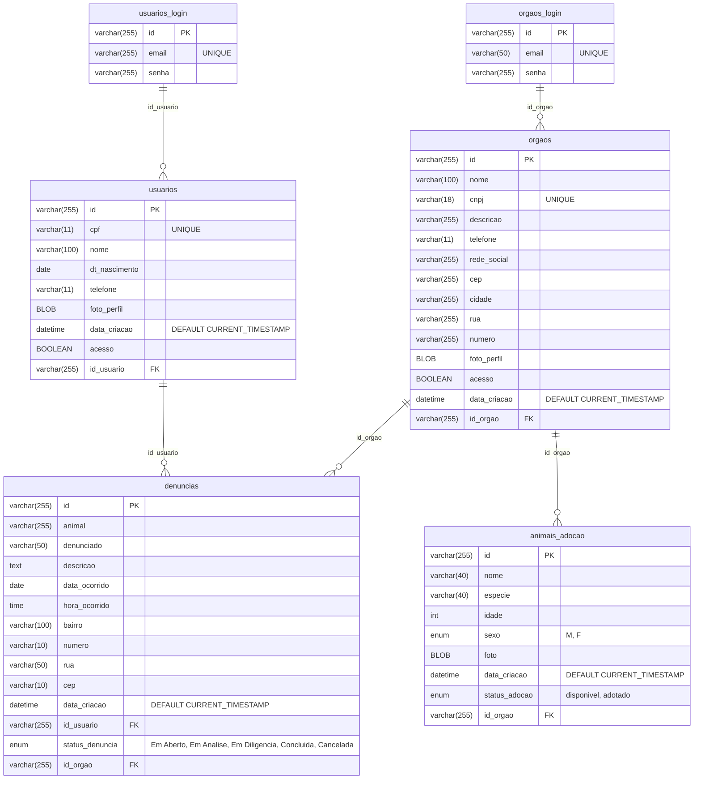

```mermaid

erDiagram

    orgaos_login {
        varchar(255) id PK
        varchar(50) email "UNIQUE"
        varchar(255) senha
    }

    usuarios_login {
        varchar(255) id PK
        varchar(255) email "UNIQUE"
        varchar(255) senha
    }

    orgaos {
        varchar(255) id PK
        varchar(100) nome
        varchar(18) cnpj "UNIQUE"
        varchar(255) descricao
        varchar(11) telefone
        varchar(255) rede_social
        varchar(255) cep
        varchar(255) cidade
        varchar(255) rua
        varchar(255) numero
        BLOB foto_perfil
        BOOLEAN acesso
        datetime data_criacao "DEFAULT CURRENT_TIMESTAMP"
        varchar(255) id_orgao FK
    }

    usuarios {
        varchar(255) id PK
        varchar(11) cpf "UNIQUE"
        varchar(100) nome
        date dt_nascimento
        varchar(11) telefone
        BLOB foto_perfil
        datetime data_criacao "DEFAULT CURRENT_TIMESTAMP"
        BOOLEAN acesso
        varchar(255) id_usuario FK
    }

    denuncias {
        varchar(255) id PK
        varchar(255) animal
        varchar(50) denunciado
        text descricao
        date data_ocorrido
        time hora_ocorrido
        varchar(100) bairro
        varchar(10) numero
        varchar(50) rua
        varchar(10) cep
        datetime data_criacao "DEFAULT CURRENT_TIMESTAMP"
        varchar(255) id_usuario FK
        enum status_denuncia "Em Aberto, Em Analise, Em Diligencia, Concluida, Cancelada"
        varchar(255) id_orgao FK
    }

    animais_adocao {
        varchar(255) id PK
        varchar(40) nome
        varchar(40) especie
        int idade
        enum sexo "M, F"
        BLOB foto
        datetime data_criacao "DEFAULT CURRENT_TIMESTAMP"
        enum status_adocao "disponivel, adotado"
        varchar(255) id_orgao FK
    }

    orgaos_login ||--o{ orgaos : "id_orgao"
    usuarios_login ||--o{ usuarios : "id_usuario"
    usuarios ||--o{ denuncias : "id_usuario"
    orgaos ||--o{ denuncias : "id_orgao"
    orgaos ||--o{ animais_adocao : "id_orgao"

```
